# Spike 4 — First beat, start re-syncs and loop wraps (2b follow-up)

> Part of the [CoderLine/alphaTab#2397](https://github.com/CoderLine/alphaTab/issues/2397) spike.
> Throwaway code on branch `spike/2397-sync-options`. Run 2026-10-08 during the design review, on
> the same machine as the other spikes (Chromium, macOS, 48 kHz), sync lab in `nudgecal` mode
> (Spike 2b), `pelados.gp` with the generated beep backing track.
> Raw numbers: [results-2026-10-08.json](./results-2026-10-08.json).

## Why

The design review asked four things the earlier spikes had not measured:

1. Is the **first beat after Play** ever skipped? The earlier start test judged "never skipped" from
   click offsets, which cannot show a skip: when the first click is missing, the next click lines up
   with the next beep and looks fine.
2. Do the **re-syncs right after Play** (the 1.5 s "settle" window) cut notes that are sounding?
   Every earlier run muted all tracks and listened to clicks only.
3. Who should own a **loop wrap** (`playbackRange` + `isLooping`): the combined player, or the
   backing track as today?
4. What changes at **stretched speeds** (0.5×, 1.5×)?

## What was added to the sync lab

- **Skip check** in the start test: the backing track's first beep after Play must have its own
  click within 50 ms. The test also counts the controller's re-syncs per start and takes a speed.
  It also fixed a harness bug: at speeds other than 1× it seeked to the wrong place
  (`api.timePosition` is in time at the current speed).
- **Loop test**: loops 2 bars for 6–11 repetitions and checks every beat: a beep with no click
  (missing), a click with no beep (extra), and the time each wrap adds beyond one beat (gap).
- **Envelope recorder**: RMS every 5 ms of the synth's or the backing track's output.

## 1. The first beat after Play can be skipped

Every start below begins exactly on a beat.

| Speed | As built: first beat skipped | Start at target: skipped | First click with start at target |
|---|---:|---:|---|
| 1.0× | **2 / 15** (the same 2 positions every run) | **0 / 15** | −5.3 … +6.7 ms |
| 0.5× | **10 / 10** | **0 / 10** | +2 … +20 ms; the 2nd click +11 … +44 ms while catching up (see below) |
| 1.5× | 0 / 10 for the synth ¹ | 0 / 10 ¹ | with a 60 ms pre-roll: −12 … +2.7 ms, backing track's first beat present 10 / 10 |

¹ At 1.5× the synth plays the first beat, but **the backing track's own first beat is silent**
(section 4).

**Cause.** On Play the spike starts the synth at *media position + calibrated latency × speed*.
At 0.5× that offset is +30 ms of song time, and at 1× +0.2 ms. When it is positive, the synth
starts just past a beat that sits exactly at the start position, so it treats that beat as already
played while the backing track plays it. Forcing the offset ≤ 0 removed every skip (1×: 0 / 11;
0.5×: 0 / 4), but at 0.5× the clicks were then ~60 ms late for the rest of the run.

**Rule that fixed it ("start at target").** The synth starts *at* the requested position, never
past it. A positive offset is caught up after the first beat by a temporary faster speed nudge
(up to 8 %, which only moves when notes start, never their pitch). At 0.5× that catch-up is still
visible in the 2nd click (+11 … +44 ms). It needs tuning, but no beat is lost.

**Start lead per speed.** The learned start lead L (how much later the synth's audio starts than
the backing track's) was one value for all speeds. The first start after a speed change was
15–55 ms off, or skipped, until L had been re-learned. With one L per speed a start never uses
another speed's L, but the first start at a speed with no learned L yet is still off (0.5×:
−29.6 ms, 1×: +5.3 ms). Learning L per speed in the background probe could close that (untested).

## 2. Start re-syncs cut sounding notes

The settle window re-syncs the synth when it is more than 4 ms off at 1×. Chrome starts the
`<audio>` element on 5.3 ms steps, so many starts land just over 4 ms and re-sync. A re-sync
silences every sounding note.

- Clicks only, tracks muted: **10 re-syncs in 6 of 15 starts.**
- With a 12 ms threshold at 1× and a faster nudge while settling (gain 300 ms): **0 re-syncs in
  30 starts** (2 runs of 15). The first click was −5.3 … +6.7 ms, and clicks were within 3 ms after ≤ 0.9 s.
- The faster nudge at 1.5× chases the time-stretch jitter (later clicks ±4–7 ms instead of
  ±1–3 ms), so use it at 1× only.
- **With the drums unmuted**, a start on bar 17 (crash + kick on beat 1) re-synced **4 times in
  the first 1.1 s** with the 4 ms threshold. Each one dropped the drums to digital silence,
  once for ~320 ms:



(Data: [spike-4-resync-cut.json](./spike-4-resync-cut.json).)

## 3. Loop wraps: combined player (A) vs backing track (B)

- **A — the combined player owns the wrap.** The inner players run without range or looping. Just
  before the range end it pauses both, seeks both to the range start and restarts them through the
  start handshake. Above 1× it seeks 60 ms before the range start (pre-roll, section 4).
- **B — the backing track owns the wrap**, as alphaTab's `BackingTrackPlayer` does today. The synth
  is silent from the media's `seeking` to `seeked` and then restarts at the range start (start-at-
  target rule).

| Speed | Owner | Wraps | Missing clicks | Extra clicks | p95 offset | Time added per wrap |
|---|---|---:|---:|---:|---:|---|
| 1.0× | **A** | 21 (2 runs) | **0** | 1 | 5.3 / 5.7 ms | under 15 ms, one wrap of 21 took 79 ms |
| 1.0× | B | 11 | 0 | 0 | 4.9 ms | **29–50 ms on 9 of 11 wraps** |
| 0.5× | **A** | 7 | **0** | 0 | 28.8 ms ² | ~24 ms |
| 0.5× | B | 6 | 0 | 2 | 15.6 ms | ~40 ms |
| 1.5× | A, no pre-roll | 11 | 5 | 17 | 8.6 ms | **one beat lost at every wrap** |
| 1.5× | **A, 60 ms pre-roll** | 10 | **0** | 1 | 5.8 ms | 23–29 ms |
| 1.5× | B | 11 | 2 | 7 | 11.1 ms | 25–36 ms, **a beat lost at 5 of 11 wraps** |

² The 0.5× catch-up from section 1 after each restart.

B's wrap is late because `BackingTrackPlayer` notices the range end on media time updates, and as
built it seeks exactly to the range start, so it cannot pre-roll at 1.5×. A wraps on a timer just before the range end, and its gap could shrink
further by wrapping earlier by a learned amount (not tried).

## 4. Above 1×, Chrome drops the start of time-stretched audio

Recording the beep backing track right after Play, exactly on a beat:

- at 1×, the first beep (t = 0) is there at full level (−9.7 dBFS), like every later beep;
- at 1.5×, **the first beep is missing in 4 / 4 starts**, and later beeps vary from −12 to −20 dBFS.

So at 1.5× any restart (Play, a seek with restart, a loop wrap) loses the first few tens of ms of
the backing track. Starting the media **60 ms before the target** puts that loss into silence:
the first beat was then present in 10 / 10 starts and in every loop repetition.

## What this means for the design

| Finding | Design change | Confidence |
|---|---|---|
| Positive latency offset puts the synth past the first beat | Start at target, never past it; catch a positive offset up after the first beat | **High** at 1× and 1.5× (0 skips); **Medium** at 0.5× (no skips, first 2 clicks late) |
| One start lead for all speeds | One learned start lead per speed | Medium (no cross-speed error; the first start at a new speed is still up to 30 ms off) |
| 4 ms settle threshold re-syncs 4–6 of 15 starts and cuts notes | 12 ms at 1× + faster nudge while settling, 1× only | High at 1× (0 / 30); untested with sustained non-drum tracks |
| Loop wrap needs one owner | The combined player owns it and restarts through the start handshake | High at 1×; Medium at 0.5× (late first clicks); High at 1.5× with pre-roll |
| Chrome drops the start of stretched audio above 1× | Pre-roll the media by ~60 ms above 1× on every (re)start | High at 1.5×; 1.25× untested |

Still open: the 0.5× catch-up (first 2 clicks after a (re)start 10–30 ms late), the per-wrap gap
of ~24 ms at 0.5× and 1.5×, one slow wrap in 21 at 1× (79 ms), and Firefox / Safari (untested).

## How to reproduce

```text
open http://localhost:5173/demos/sync-spike/?mode=nudgecal&src=beeps
(wait for the calibration log line, then in the console:)
spikePlayer.startAtTarget = true            // false = as built
spikePlayer.settleResyncThreshold = 12      // 4 = as built
spikePlayer.settleNudgeGainMillis = 300     // 3000 = as built
await spikeStartTest(15, 0, 1)              // n starts, ms before the beat, speed
await spikeStartTest(10, 60, 1.5)           // 60 ms pre-roll at 1.5x
spikePlayer.loopPreRoll = 60
await spikeLoopTest('combined', 1.5, 2, 10) // owner 'combined' | 'media', speed, bars, wraps
```

Code: `MixSpikePlayer.ts` (`startAtTarget`, `_scheduleLoopWrap`, `_wrapCombined`, `_hookMediaLoop`)
and `demos/sync-spike/index.ts` (`startTest`, `loopTest`).
